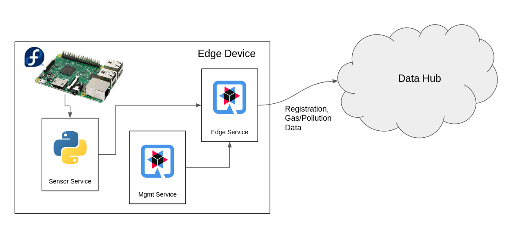

# QIOT Hackfest Air Quality Edge Service  


This service retrieves gas and pollution readings from the Air Quality Sensor Service (https://github.com/DevoteamNL/qiot-hackfest-sensor-service) and sends data to a central data hub. The service is responsible for the registration process with the data hub and sending air quality data via mqtt. 




## Service Implementation

The edge service is implemented in Quarkus and compiled to native code running in a docker container in order to keep the startup times low and keep the container size small.

When the service is started, it automatically registers the edge device with the data hub.

### Registration API (Data Hub)

| Registration API URL | HTTP Method | Resource |
| ---------- | ---------- | ---------- |
| http://qiot-registration-qiot.apps.cluster-emeaiot-d864.emeaiot-d864.example.opentlc.com/ | PUT | /register/serial/{serial}/name/{name}/longitude/{longitude}/latitude/{latitude}|

For the other operations, you can download the OpenAPI spec: http://qiot-registration-qiot.apps.cluster-emeaiot-d864.emeaiot-d864.example.opentlc.com/openapi


## Building a docker container for deployment on the raspberry PI

The docker files are structured to provide a build that can compile (using multiarch) an aarch64 docker image on any x86_64 linux machine. https://github.com/DevoteamNL/quarkus-native-builder-multiarch

This builder image contains the GraalVM binaries.


### Cross-compiling on a x86_64 linux host

First enable the host to use binfmt in order to allow architecture emulation using qemu

``` 
# configure binfmt-support on the Docker host (works locally or remotely, i.e: using boot2docker)
docker run --rm --privileged multiarch/qemu-user-static:register --reset
```

Now you can compile aarch64 docker containers

```
docker build -t [docker image tag name] -f Dockerfile.native.multiarch .
```

We use the `Dockerfile.native.mulitarch` container along with GitHub actions to build the containers natively upon commit to master.
For any feature branch, we just compile and see if things run. :-) 
